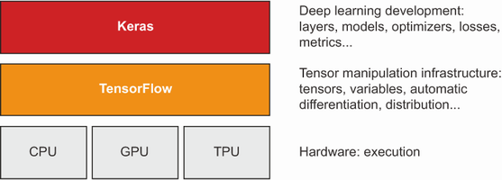
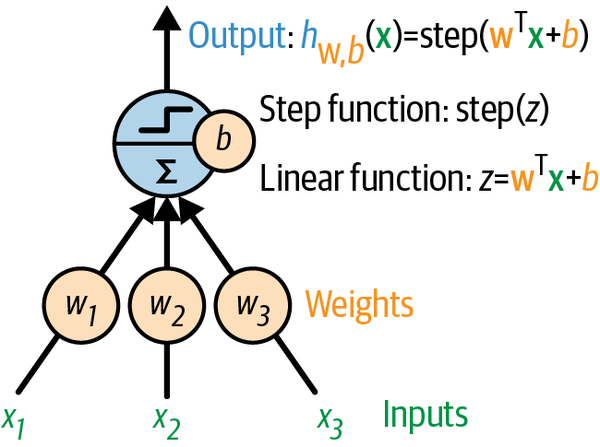
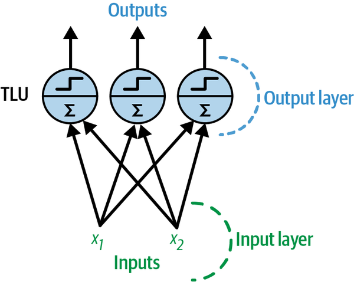
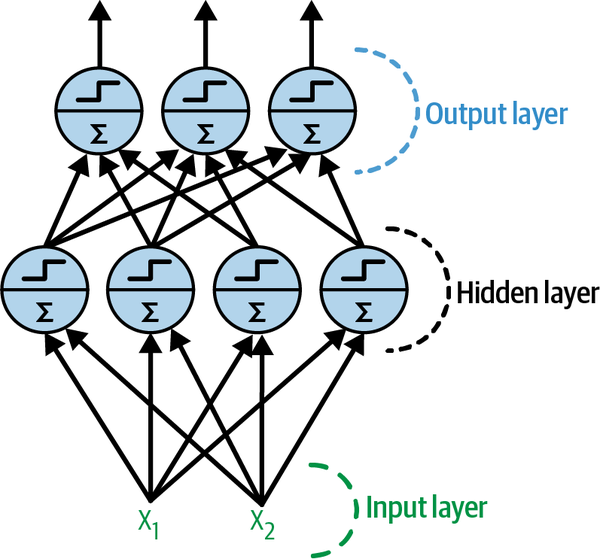
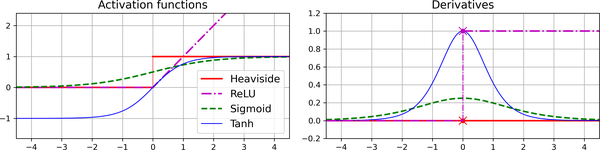

# Introduction to Keras and Tensorflow

## 1. What is Tensorflow

- TensorFlow is a Python-based, free, open source machine learning platform, developed primarily by Google.
- It’s really a **PLATFORM**, home to a vast ecosystem of components, some developed by Google and some developed by third parties.
- For instance:
  - `TF-Agents` for reinforcement-learning research
  - `TFX` for industry-strength machine learning workflow management
  - `TensorFlow Serving` for production deployment
  - `TensorFlow Hub` repository of pretrained models.

## 2. What is Keras

- Keras is a deep learning API for Python, built on top of TensorFlow, that provides a convenient way to define and train any kind of deep learning model.
- Through TensorFlow, Keras can run on top of different types of hardware: GPU, TPU, or plain CPU—and can be seamlessly scaled to thousands of machines.
- TensorFlow is a low-level tensor computing platform, and Keras is a high-level deep learning API

## 3. Common Concepts

### Low-level tensor manipulation

- Low-level tensor manipulation—the infrastructure that underlies all modern machine learning.
- This translates to **TensorFlow APIs**:
  - _Tensors_: including special tensors that store the network’s state (variables)
  - _Tensor operations_ such as `addition`, `relu`, `matmul`
  - _Backpropagation_ a way to compute the gradient of mathematical expressions (handled in TensorFlow via the `GradientTape` object)

### High-level deep learning concepts

- This translates to Keras APIs:
  - _Layers_, which are combined into a model
  - _Loss function_ which defines the feedback signal used for learning
  - _Optimizer_ which determines how learning proceeds
  - _Metrics_ to evaluate model performance, such as accuracy
  - _Training loop_ that performs mini-batch stochastic gradient descent
  - _Metrics_ to evaluate model performance, such as accuracy

## 3. What is Artificial Neural Networks

### Threshold Logic Unit (TLU)

- Step 1: The TLU computes a linear function of its inputs: $z = w_1 x_1 + w_2 x_2 + ⋯ + w_n x_n + b = w_⊺ x + b$.
- Step 2: Then it applies a step function to the result: $h_w(x) = step(z)$.

### Perceptron

- A **perceptron** is composed of one or more TLUs organized in a single layer.
  - Such a layer is called a **fully connected layer**, or a **dense layer**
  

   
  Architecture of a perceptron with two inputs and three output neurons
  

- Computing the outputs of a fully connected layer, where:

  - $X$ represents the matrix of input features
  - $W$ weight matrix
  - $b$ bias vector
  - $\phi$ activation function

  $$h_{W,b}(X) = \phi(XW + b)$$

### Multi-Layer Perceptron (MLP)

- An MLP is composed of
  - One input layer
  - One or more layers of TLUs called hidden layers
  - One final layer of TLUs called the output layer
  

    
   Architecture of a multilayer perceptron with two inputs, one hidden layer of four neurons, and three output neurons
   

### Backpropagation

- Backpropagation is the most popular training technique for neural networks which allows neural networks to learn useful internal representations.

#### How Backpropagation Works

- It handles one mini-batch at a time (for example, containing 32 instances each), and it goes through the full training set multiple times.
  - Each pass is called an **epoch**.
- **Forward Pass**:
  - Each mini-batch enters the network through the input layer
  - The algorithm then computes the output of all the neurons in the first hidden layer
  - The result is passed on to the next layer, its output is computed and passed to the next layer, and so on until we get the output of the last layer, the output layer.
- **Loss Computation**: the algorithm measures the network’s output error (i.e., it uses a loss function that compares the desired output and the actual output of the network, and returns some measure of the error).
- Backward Pass:
  - Apply chain rule to compute how much of these error contributions came from each connection in the layer below
  - Using the chain rule & working backward until it reaches the input layer.
  - This reverse pass efficiently measures the error gradient across all the connection weights and biases in the network by propagating the error gradient backward through the network
- In short, backpropagation makes predictions for a mini-batch (forward pass), measures the error, then goes through each layer in reverse to measure the error contribution from each parameter (reverse pass), and finally tweaks the connection weights and biases to reduce the error (gradient descent step).

#### Activation Function

- In order for backprop to work properly, we need to use the activation function.
- Two popular choices of activation functions:
  - **Hyperbolic Tangent function**: $tanh(z) = 2σ(2z) – 1$
    - Output range: –1 to 1
    - make each layer’s output more or less centered around 0 at the beginning of training, which often helps speed up convergence.
  - **Rectified Linear Unit function** (RELU): $ReLU(z) = max(0, z)$ - The ReLU function is continuous but unfortunately not differentiable at $z = 0$ - It works very well and has the advantage of being fast to compute

    
   Activation functions (left) and their derivatives (right)

##### Why do we need activation funciton

- For example, if $f(x) = 2x + 3$ and $g(x) = 5x – 1$, then chaining these two linear functions gives you another linear function: $f(g(x)) = 2(5x – 1) + 3 = 10x + 1$,
- Hence if you don’t have some non-linearity between layers, then even a deep stack of layers is equivalent to a single layer, and you can’t solve very complex problems with that.
